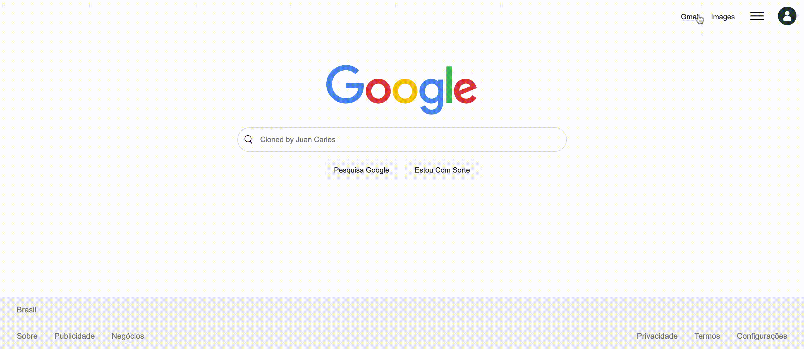

# 📌 CLONE PAGE: GOOGLE (HTML / CSS)

## Table of contents

* 📑 [Description](#description)
* 🔛 [Demo](#demo)
* 💻 [Technologies](#technologies)
* 🔨 [Features](#features)
* 📋 [How to use](#how-to-use)
* :octocat: [Authors](#authors)

## Description
Clone of Google Website, to pratice HTML and CSS concepts, such as semantch, CSS variables, selectors, pseudo-classes and responsive layout. 

## Demo

## Technologies
 

## Features
* Google website interface,
* CSS variables;
* BEM methodology;
* Responsive layout.

## How to use
- `Step 1`: Download the project's files.
- `Step 2`: Execute the "index.html" file on any browser.

## Authors
| [ Juan Carlos](https://github.com/juan-soaraes) |
| :---: |